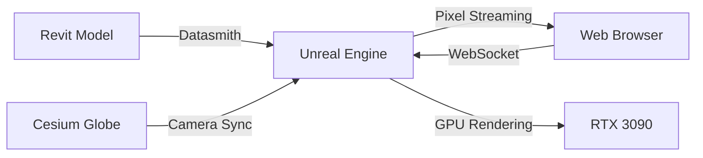

# Unreal Engine BIM Integration

This document explains how to integrate Unreal Engine with the Global Health BIM Dashboard for cinematic-quality visualizations.

## Overview

The Unreal Engine integration provides:
- **Pixel Streaming**: High-quality rendering streamed to your browser
- **Datasmith Direct Link**: Live connection to Revit models
- **Cesium for Unreal**: Global context for BIM models
- **Health Data Visualization**: Cinematic effects for crisis visualization

## Architecture



## Setup

### 1. Prerequisites

- Unreal Engine 5.3+ installed
- Cesium for Unreal plugin
- Datasmith plugin for Revit
- NVIDIA GPU (RTX 3090 recommended)

### 2. Docker Configuration

The Unreal pixel streaming service is already configured in `docker-compose.yml`:

```bash
# Start with Unreal profile
docker-compose --profile unreal up

# Or just the Unreal service
docker-compose up unreal-pixel-streaming
```

### 3. Unreal Project Setup

1. Create a new Unreal project or use existing
2. Install plugins:
   - Cesium for Unreal
   - Pixel Streaming
   - Datasmith

3. Configure Cesium:
```cpp
// In your level blueprint
ACesiumGeoreference* Georef = GetWorld()->SpawnActor<ACesiumGeoreference>();
Georef->SetGeoreferenceOriginLongitudeLatitudeHeight(
    -77.0369,  // Your location
    38.8977,
    0.0
);

// Add your Ion assets
ACesium3DTileset* Buildings = GetWorld()->SpawnActor<ACesium3DTileset>();
Buildings->SetIonAssetID(2521176);  // Your OSM Buildings
Buildings->SetIonAccessToken(TEXT("your-token"));
```

### 4. Package for Linux

```bash
# In Unreal Editor
File > Package Project > Linux

# Or via command line
/Engine/Build/BatchFiles/RunUAT.sh BuildCookRun \
    -project="/path/to/GlobalHealthBIM.uproject" \
    -platform=Linux \
    -serverconfig=Development \
    -cook -stage -package
```

### 5. Deploy to Docker

Place your packaged project in:
```
./data/unreal-projects/GlobalHealthBIM/
```

The container will automatically run it with pixel streaming enabled.

## Revit Integration

### 1. Install Datasmith Exporter

Download from Epic Games Launcher:
- Tools > Datasmith Exporter for Revit

### 2. Export from Revit

```csharp
// In Revit
1. Open your BIM model
2. Click "Datasmith" tab
3. Select "Direct Link" or "Export"
4. Choose elements to include
```

### 3. Import to Unreal

```cpp
// Automatic with Direct Link
// Or manual import:
UDatasmithSceneElement* Scene = 
    FDatasmithSceneFactory::CreateScene("Hospital");
DatasmithImporter->ImportScene(Scene);
```

## Web Integration

### In Your Cesium Viewer

```javascript
import { integrateUnrealWithCesium } from './unreal-integration.js';

// Initialize Cesium viewer
const viewer = new Cesium.Viewer('cesiumContainer');

// Add Unreal integration
const unrealStream = integrateUnrealWithCesium(viewer);

// Load a BIM model
unrealStream.loadBIMModel('/datasmith/hospital.udatasmith', {
    georeferenced: true,
    position: {
        longitude: -77.0369,
        latitude: 38.8977,
        height: 0
    }
});
```

### Health Visualizations

```javascript
// Hospital capacity visualization
viewer.entities.add({
    position: Cesium.Cartesian3.fromDegrees(lon, lat),
    properties: {
        revitGuid: 'hospital-guid-123',
        healthData: {
            type: 'hospital',
            occupancy: {
                general: 0.85,
                icu: 0.95,
                critical: 0.92
            }
        }
    }
});

// When selected, automatically shows in Unreal with:
// - Color-coded rooms by occupancy
// - Patient flow particles
// - Real-time metrics overlay
```

## Performance Optimization

### 1. GPU Settings

```javascript
// In docker-compose.yml
environment:
  - NVIDIA_VISIBLE_DEVICES=0  # Use RTX 3090
  - PIXEL_STREAMING_ENCODER_TARGET_BITRATE=20000000  # 20 Mbps
  - RENDER_QUALITY=Ultra
```

### 2. LOD Settings

```cpp
// In Unreal
DatasmithMeshActor->SetLODDistances({
    500.0f,   // LOD 0 - Full detail
    1000.0f,  // LOD 1 - Medium
    2000.0f,  // LOD 2 - Low
    5000.0f   // LOD 3 - Minimum
});
```

### 3. Streaming Optimization

- Use NVENC hardware encoding
- Adjust bitrate based on network
- Enable adaptive quality

## Example Workflows

### 1. Crisis Response Visualization

```javascript
// Earthquake impact on buildings
unrealStream.visualizeSeismicRisk({
    magnitude: 7.2,
    location: {
        longitude: -118.24,
        latitude: 34.05
    },
    affectedBuildings: ['bldg-1', 'bldg-2', 'bldg-3']
});

// Shows in Unreal:
// - Building stress visualization
// - Seismic wave propagation
// - Structural damage assessment
```

### 2. Disease Outbreak Tracking

```javascript
// COVID-19 hospital capacity
unrealStream.applyHealthVisualization('pandemic_response', {
    hospitals: hospitalData,
    infectionRate: 2.3,
    ventilatorUsage: 0.78,
    showAirflow: true,
    particleVirusSpread: true
});
```

### 3. Infrastructure Planning

```javascript
// Sea level rise impact
unrealStream.loadBIMModel('/coastal-infrastructure.udatasmith', {
    waterLevel: projectedSeaLevel2050,
    showFlooding: true,
    tidalAnimation: true
});
```

## Troubleshooting

### Container Won't Start
```bash
# Check GPU availability
docker run --rm --gpus all nvidia/cuda:11.8.0-base-ubuntu22.04 nvidia-smi

# Check logs
docker-compose logs unreal-pixel-streaming
```

### No Stream Visible
1. Check firewall for ports 8090, 8888, 19302-19303
2. Verify Unreal project is packaged correctly
3. Check browser WebRTC support

### Performance Issues
1. Reduce stream quality in signaling-config.json
2. Lower Unreal scalability settings
3. Use hardware encoding (NVENC)

## Advanced Features

### Custom Post-Processing

```cpp
// Health crisis visualization effects
UPostProcessComponent* HealthViz = CreateDefaultSubobject<UPostProcessComponent>(TEXT("HealthViz"));

// Dynamic material instance for data visualization
UMaterialInstanceDynamic* HeatmapMaterial = UMaterialInstanceDynamic::Create(HeatmapBaseMaterial, this);
HeatmapMaterial->SetScalarParameterValue("Intensity", CrisisLevel);
HeatmapMaterial->SetVectorParameterValue("ColorRamp", FLinearColor::Red);
```

### WebSocket Commands

```javascript
// Custom commands to Unreal
unrealStream.sendToUnreal({
    type: 'custom_effect',
    data: {
        effect: 'explosion_damage',
        location: [x, y, z],
        radius: 100,
        intensity: 0.8
    }
});
```

## Next Steps

1. Package your Unreal project
2. Place in `./data/unreal-projects/`
3. Start services: `docker-compose --profile unreal up`
4. Access at http://localhost:8084 (Cesium viewer with Unreal integration)

The integration automatically handles:
- Camera synchronization
- Entity selection
- Data visualization
- Performance optimization

For production deployment, consider:
- Multiple GPU nodes for scaling
- CDN for static assets
- Load balancing for pixel streaming
